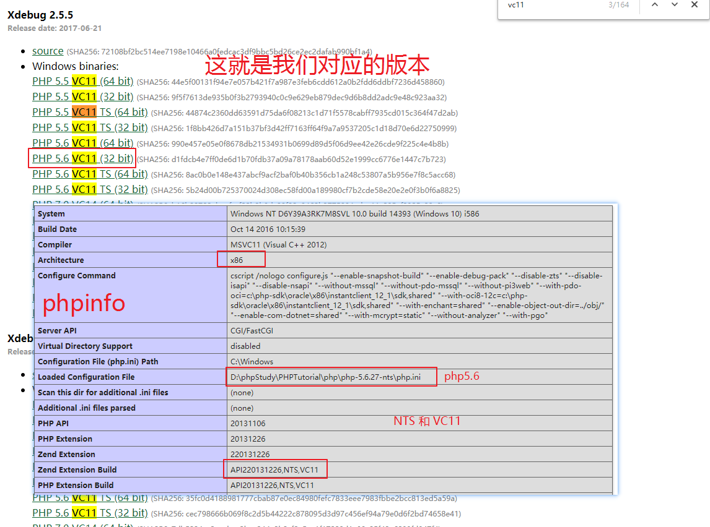
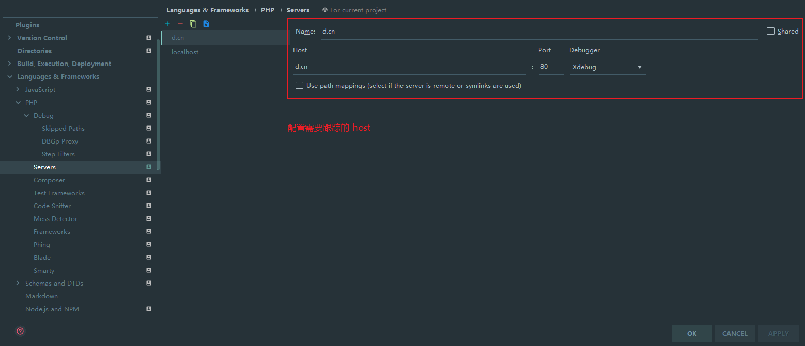

### 开始之前

所处环境

* Windows10 64位
* PHPStudy 整套 （php 版本 5.6 vc11 nts ）
* Chrome 69
* PHPStorm 2018.1.6
* xdebug 扩展版本 2.5.1

| 名称          | 属性                      |
| ------------- | ------------------------- |
| PHPStorm      | 当前 PHP 界排名第一的 IDE |
| Xdebug.dll    | PHP 扩展                  |
| Xdebug helper | Chrome 扩展               |

## Xdebug.dll

#### 下载

[官网](https://xdebug.org/download.php)



选择版本：

> **注意：把下载下来的 xdebug.dll 移动到 php 安装目录的 ext 目录。**

#### 配置 php.ini

在 php.ini 追加

```ini
[XDebug]
; 这个就是刚才下载的 xdebug.dll 
zend_extension=php_xdebug-2.5.1-5.6-vc11-nts.dll
xdebug.profiler_append = 0
xdebug.profiler_enable = 1
xdebug.profiler_enable_trigger = 0
xdebug.profiler_output_dir ="D:\phpStudy\tmp\xdebug"
xdebug.trace_output_dir ="D:\phpStudy\tmp\xdebug"
xdebug.profiler_output_name = "cache.out.%t-%s"
xdebug.remote_enable = 1
xdebug.remote_handler = "dbgp"
xdebug.remote_host = "127.0.0.1"
xdebug.remote_port = 9000
xdebug.remote_mode = "req"
xdebug.idekey = PHPSTORM
```

### Xdebug helper

#### 下载并安装

* [合法签证](https://chrome.google.com/webstore/detail/xdebug-helper/eadndfjplgieldjbigjakmdgkmoaaaoc?hl=zh-CN)
* [偷渡](https://www.crx4chrome.com/crx/1716/)

#### 配置

 

 

* [图片来源](https://www.cnblogs.com/LWMLWM/p/8251905.html)

### 配置 PHPStorm

` Ctrl + Alt + s ` 打开设置




### 如何使用

使用前：

* 确保 Xdebug helper 处于 Debug 状态
* 确保所有配置正确

例：

> PHP 项目 MyBlog （域名配置：http://d.cn）入口文件 index.php 第三行加入断点，打开  http://d.cn ，phpstorm 自动置顶显示 Debug 按钮。

快捷键 F7 继续向下逐步执行进行调试。

#### 最后

以上介绍说的都比较笼统，只是大概的介绍个流程，需要有一定的 PHP 基础才能看懂。

……

好长时间都没有写过博客了，上篇博客停留在一个半月前……

这段时间有好消息，也有坏消息，生活过的还是一如既往的糟糕，还是毫无目标的活着；

最近这两天好了些，早睡早起开始背单词了，因为被在早些几天的时候得了很多奇奇怪怪的病，身体状况很是差劲，回到家也是去医院看病……

经历了所有的喜怒哀乐没人分享，期间很多很多很多很多很多的感想与想法……


